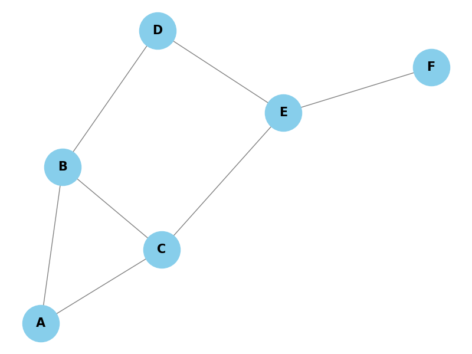

# Аналіз графу транспортної мережі міста

## Основні характеристики

- **Кількість вершин:** 6
- **Кількість ребер:** 7

## Ступені вершин

| Вершина | Ступінь |
|---------|---------|
| A       | 2       |
| B       | 3       |
| C       | 3       |
| D       | 2       |
| E       | 3       |
| F       | 1       |

## Центральність ступеня

| Вершина | Центральність ступеня |
|---------|------------------------|
| A       | 0.4                    |
| B       | 0.6                    |
| C       | 0.6                    |
| D       | 0.4                    |
| E       | 0.6                    |
| F       | 0.2                    |

## Середній ступінь

- **Середній ступінь вершин:** 2.33

## Візуалізація графу

